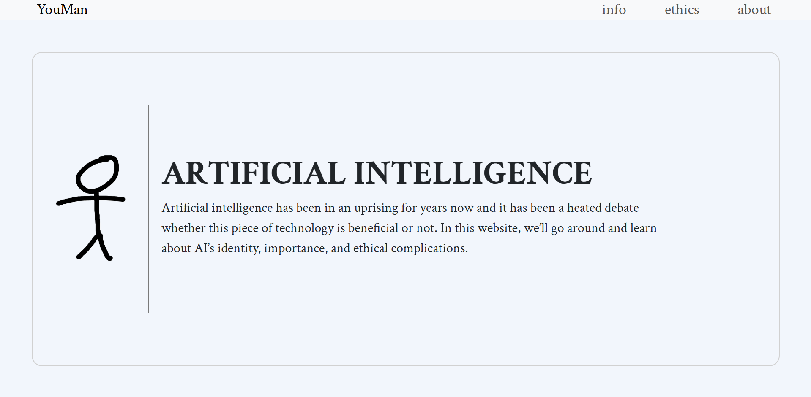
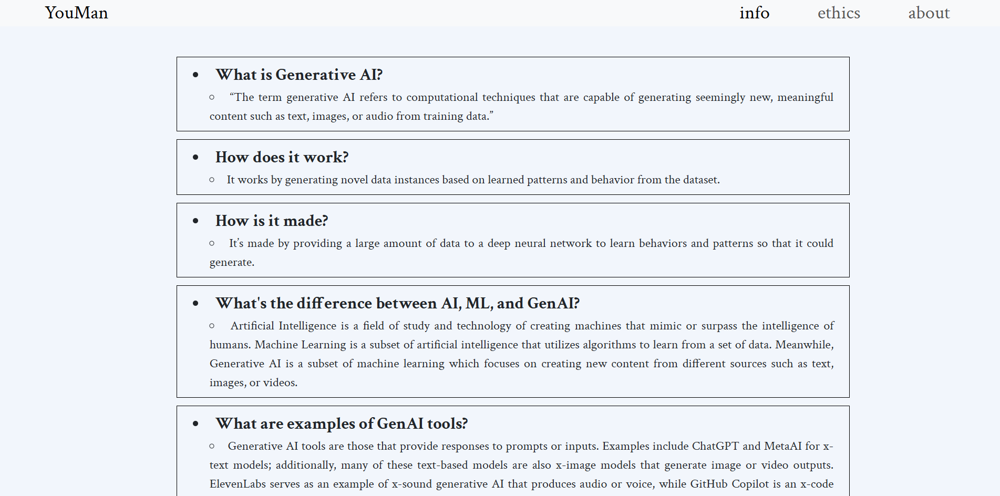
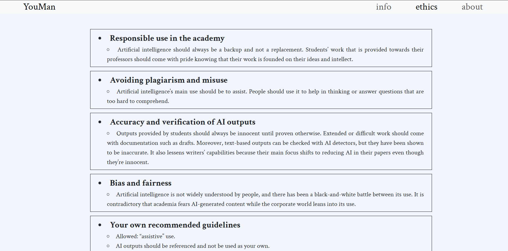
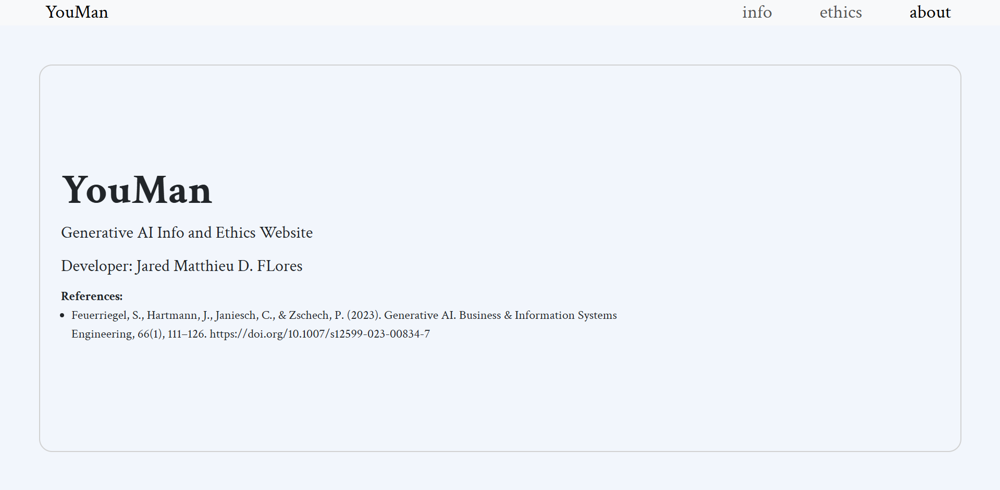

# CSDC100_PreFinals

## Project Overview
A requirement for Pre Finals of CSDC100 in Computer Science at Ateneo de Naga University. Website made to inform and discuss the ethics behind Generative AI.

## Instructions
- Open this website on your browser: "https://jaredmatthieu.github.io/CSDC100_PreFinals/src/pages/about.html"
- You may also save the source code and launch open "index.html" in your browser.

## Utilized Frameworks/Libraries
-Bootstrap
-CSS

## Project Screenshots

